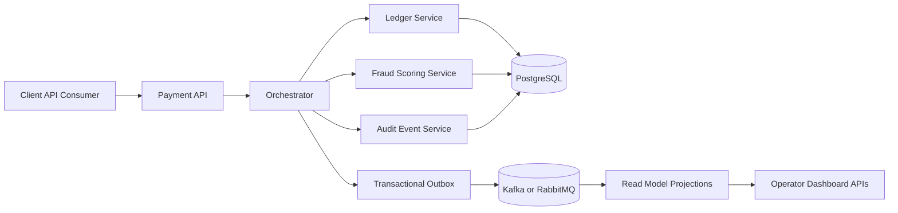
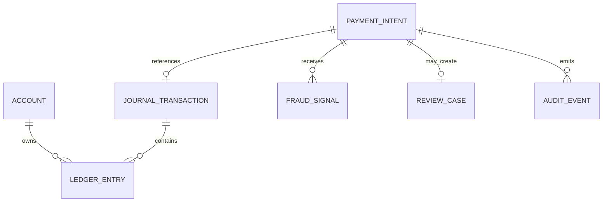
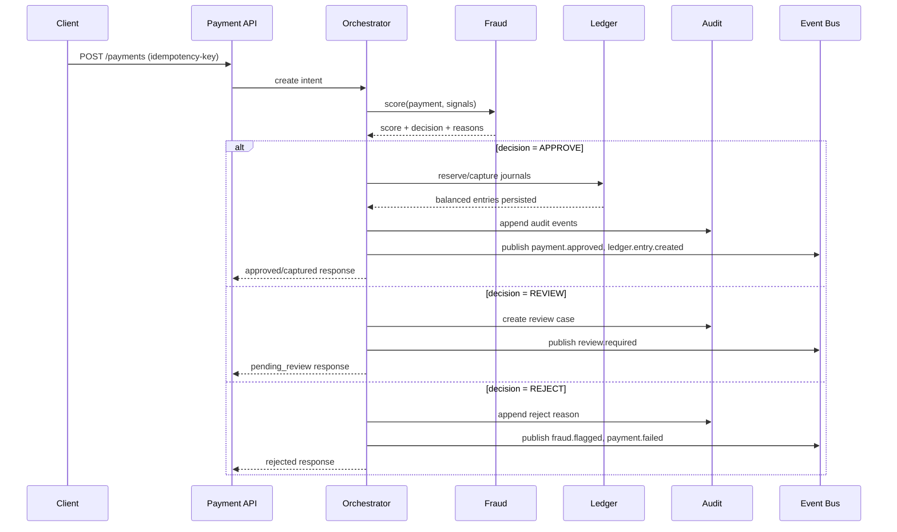

# Architecture Overview

LedgerForge Payments is a local-first fintech backend that processes payments through a deterministic workflow:

1. API receives a payment intent.
2. Fraud service computes real-time risk.
3. Orchestrator decides approve/review/reject.
4. Ledger writes immutable balanced entries for reserve/capture/refund/reversal.
5. Account freeze controls stop new money movement without mutating prior ledger history.
6. Audit and events are emitted for operator views and downstream consumers.

The ledger is the source of truth. Balances are projections from immutable entries.

Operational control note:

- `ACTIVE` accounts can participate in normal create, confirm, capture, and manual-review approval flows.
- `FROZEN` accounts block new outward payment progression and manual-review approvals.
- `FROZEN` accounts can still participate in `REFUND` and `REVERSAL` journals so operators can unwind exposure without rewriting history.

## Modular Monolith Structure

The recommended MVP implementation is a modular monolith with explicit boundaries:

- `payments`: payment intents, lifecycle transitions, idempotency
- `ledger`: accounts, journals, entries, balance projection
- `fraud`: scoring, rules, review cases
- `orchestrator`: flow coordination and compensation
- `audit`: immutable event trail for compliance and debugging
- `admin`: operator-facing reporting and reconciliation endpoints

## High-Level Component Diagram

## Core Data Relationships

## Request and Event Flow

## Deployment Notes

- Start as one service with module boundaries and separate packages.
- Persist all financial state in PostgreSQL with Flyway/Liquibase migrations.
- Use Redis for idempotency key cache and velocity counters (optional in MVP).
- Introduce async bus and outbox in phase 2 for higher throughput and decoupling.
