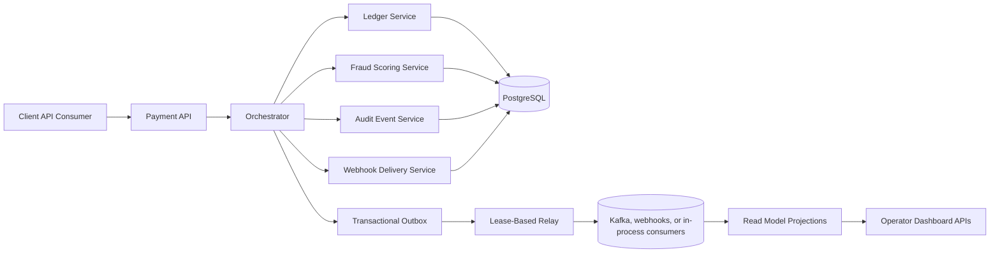
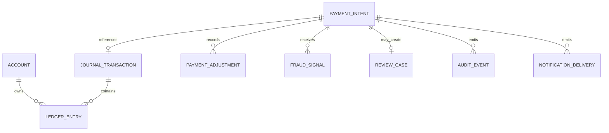
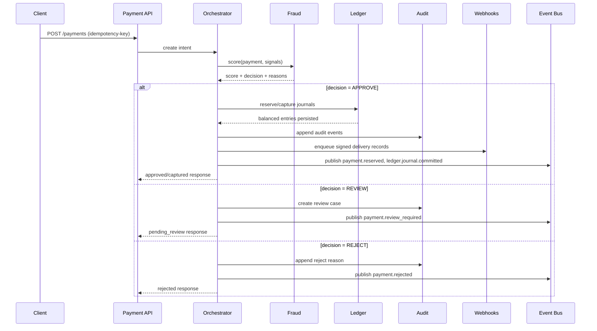

# Architecture Overview

LedgerForge Payments is a local-first fintech backend that processes payments through a deterministic workflow:

1. API receives a payment intent.
2. Fraud service computes real-time risk.
3. Orchestrator decides approve/review/reject.
4. Ledger writes immutable balanced entries for reserve/capture/refund/reversal/chargeback.
5. Account freeze controls block new reserve/capture money movement while still permitting operator recovery journals.
6. Audit events, immutable payment adjustment history, and transactional outbox rows are emitted for operator views and downstream consumers.
7. Payment lifecycle notifications fan out into signed webhook delivery records with callback acknowledgements tracked outside the ledger.

The ledger is the source of truth. Balances are projections from immutable entries.

Operational control note:

- `ACTIVE` accounts can participate in normal payment creation, confirmation, and capture flows.
- `FROZEN` accounts block new outward payment progression, manual-review approval, and capture completion.
- `FROZEN` accounts still allow `REVERSAL`, `REFUND`, and `CHARGEBACK` journals so operators can unwind exposure without mutating prior ledger history.

## Modular Monolith Structure

The recommended initial implementation is a modular monolith with explicit boundaries:

- `payments`: payment intents, lifecycle transitions, idempotency
- `ledger`: accounts, journals, entries, balance projection
- `fraud`: scoring, rules, review cases
- `orchestrator`: flow coordination and compensation
- `audit`: immutable event trail for compliance and debugging
- `notification`: webhook endpoint registry, signed delivery attempts, and callback receipts
- `admin`: operator-facing reporting and reconciliation endpoints

## High-Level Component Diagram

## Core Data Relationships

## Request and Event Flow

## Deployment Notes

- Start as one service with module boundaries and separate packages.
- Persist all financial state in PostgreSQL with Flyway/Liquibase migrations.
- Use Redis for idempotency key cache and velocity counters where operationally useful.
- The current implementation uses a database-backed outbox plus a scheduled relay. Future deployments can replace the default publisher with Kafka, RabbitMQ, or broader webhook fan-out without moving source-of-truth writes out of the local transaction boundary.
- Webhook callbacks can acknowledge or reject deliveries, but they do not mutate ledger balances directly.
