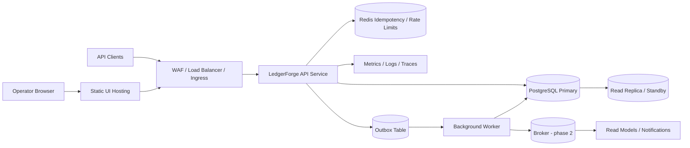

# Deployment Topology and Release Promotion

This document defines the target operating model for LedgerForge beyond local demo mode. It separates what exists in the repository today from the staging and production shape the platform should converge on.

## Operating Principles

- The ledger-backed PostgreSQL database is the source of truth for balances, payment state, and journal history.
- Every deployment must preserve immutable audit history and balanced journal transactions.
- Payment write APIs stay idempotent across retries, rollbacks, and multi-instance execution.
- Each environment owns its own infrastructure, credentials, and data stores. No database, cache, or secret is shared across environments.
- Release artifacts are built once and promoted unchanged between environments.

## Environment Strategy

| Environment | Purpose | Runtime shape | Data policy | Release policy |
| --- | --- | --- | --- | --- |
| `local` | Developer setup and demo flows | Single backend process, local frontend dev server, H2 by default or Postgres profile, optional Redis/Kafka | Disposable synthetic data | Direct local runs and smoke checks |
| `staging` | Production-like validation and operator rehearsal | Separate frontend and backend deploys, managed PostgreSQL, at least two backend instances, managed secrets, production auth integration | Synthetic or scrubbed non-production data only | Auto-deploy the candidate artifact from `main` after CI passes |
| `production` | Live payment traffic and operator workflows | Same topology as staging, but with HA data tier, stricter scaling floors, and incident controls enabled | Production data only, immutable audit retention | Manual promotion of the exact staging-approved artifact |

`staging` and `production` should live in separate accounts/projects and separate Kubernetes namespaces or equivalent isolated deployment targets. The implementation can run on any container platform, but it must support rolling updates, readiness probes, secret injection, and distinct service identities per workload.

## Recommended Topology

The first production-style release should stay operationally simple: a modular monolith for request handling plus separate background execution where asynchronous work exists.

### Workload boundaries

- `frontend`: static operator console assets served by CDN or object storage plus edge cache.
- `api`: Spring Boot service that owns payment writes, ledger posting, fraud orchestration, audit emission, and read APIs.
- `worker`: separate process image or command derived from the same backend codebase for outbox draining, reconciliation sweeps, and replay jobs.
- `postgres`: primary database with HA/backup support; all financial truth stays here.
- `redis`: idempotency key storage, short-lived replay protection, and rate-limit counters once multi-instance traffic begins.
- `broker`: introduced only when asynchronous consumers move beyond in-process execution; keep the outbox table as the durable handoff boundary either way.

## Runtime Configuration Boundaries

Configuration must be split by volatility and sensitivity.

### Repository-managed defaults

Safe local defaults may stay in versioned files:

- backend application defaults in `backend/src/main/resources/application.yml`
- Postgres profile defaults in `backend/src/main/resources/application-postgres.yml`
- frontend local API wiring such as `VITE_API_BASE_URL`

These defaults must never contain environment-specific hostnames, real credentials, or production-only toggles.

### Environment-managed non-secret config

Per-environment runtime values belong in the deployment system, not in Git-tracked files:

- `SPRING_PROFILES_ACTIVE`
- `PORT`
- canonical API base URL for the operator UI
- CORS allowlists
- replica counts, autoscaling thresholds, and resource limits
- feature flags controlling rollout of new payment paths, review rules, or operator tools

### Secret-managed config

Secrets must come from a secret manager or sealed secret workflow:

- `DB_URL`, `DB_USER`, `DB_PASSWORD`
- OIDC client secrets and signing keys
- webhook signing secrets
- broker credentials
- any future external settlement or banking credentials

Do not use `VITE_API_BEARER_TOKEN` outside local or temporary test scenarios. A static frontend bundle cannot safely hold a long-lived production operator token. Production operator access should terminate through OIDC-backed browser auth, session cookies, or short-lived token exchange at the edge/backend boundary.

## Health, Scaling, and Resilience

- Run at least two backend instances in staging and production so idempotency, locking, and retry behavior are exercised under concurrent execution.
- Use readiness probes that fail while Flyway migrations are still running or when the database is unavailable.
- Keep actuator health and Prometheus metrics enabled behind trusted network boundaries.
- Scale API replicas on CPU plus request latency; scale workers on outbox lag and reconciliation backlog.
- Prefer multi-AZ database deployment in production. A single-region footprint is acceptable initially, but the region must tolerate zone loss without ledger data loss.

## Database and Migration Policy

- Flyway migrations are forward-only and applied automatically on startup in lower environments.
- Production migrations should run as a distinct pre-deploy step or controlled startup hook so failures do not partially roll the fleet.
- Use expand-and-contract changes for payment and ledger tables. Do not combine destructive column removal with application rollout in the same release.
- After each staging and production migration, run ledger verification and a payment idempotency smoke test before considering the release healthy.
- Database restores are incident procedures, not standard rollback tactics. Application rollback must assume the latest successful schema is still present.

## Release Promotion Flow

1. A change merges to `main` only after code review and repository docs updates are included.
2. CI builds immutable backend and frontend artifacts tagged with the Git SHA.
3. CI runs backend tests, frontend build checks, and targeted smoke or benchmark gates.
4. The exact artifact digest is deployed automatically to `staging`.
5. Staging validates:
   - health/readiness checks
   - payment create/confirm idempotency
   - ledger verification
   - fraud review path
   - operator console connectivity
6. Production promotion is manual and uses the same artifact digest that passed staging.
7. Production starts with a rolling or canary deploy, then monitors payment errors, ledger verification output, review backlog growth, and outbox lag before full rollout completes.

## Rollback Strategy

- If the release is application-only and schema-compatible, roll back to the previous artifact digest.
- If the release includes an irreversible schema expansion, disable the new path with feature flags and ship a forward fix instead of restoring an older binary blindly.
- If ledger integrity is ever in doubt, stop payment mutations, keep audit collection on, run replay and verification tooling, and recover with append-only corrective journals rather than destructive data edits.

## Promotion Gates

The minimum promotion checklist for `staging` to `production` is:

- backend tests pass
- frontend build passes
- no failed Flyway migrations
- payment idempotency smoke passes
- ledger verification reports zero broken journals
- staging dashboards show healthy request rate, error rate, and latency after deploy
- operator login and review actions work against the promoted backend

## Delivery Sequence

The implementation should proceed in this order:

1. Containerize backend and frontend with environment-based config injection.
2. Stand up a staging environment with managed PostgreSQL, OIDC, and secret-backed runtime config.
3. Add CI pipelines that build once, deploy to staging, and support manual production promotion of the same artifact.
4. Split background processing from the API service as outbox and reconciliation workload grows.
5. Introduce broker-backed event consumers once async integrations require independent scaling.
