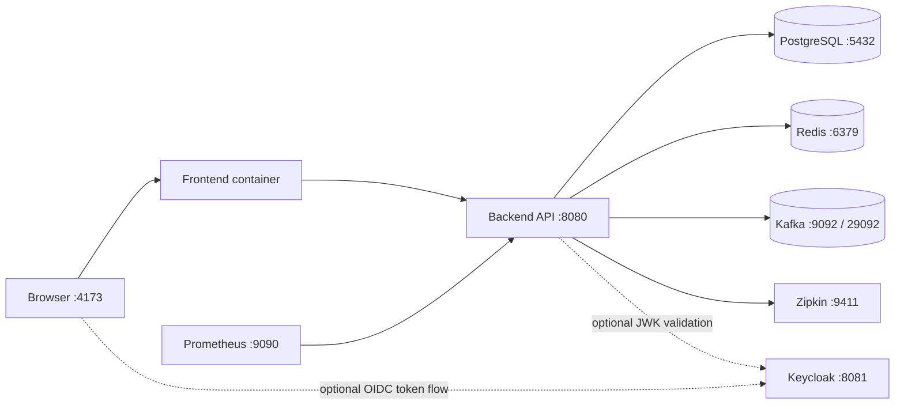
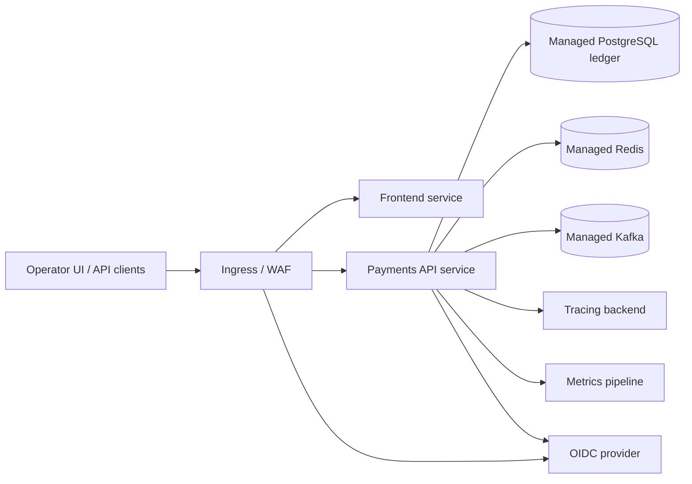

# Deployment Topology

This document captures the current local container topology and the intended shared-environment shape for LedgerForge Payments.

## Local Compose Topology

LedgerForge now supports a containerized local stack that can run the backend, operator console, data stores, broker, tracing collector, and an optional OIDC provider together.

Profiles:

- default: PostgreSQL only for fast backend iteration with `SPRING_PROFILES_ACTIVE=postgres`
- `platform`: adds Redis, Kafka, Zipkin, and Prometheus so the local shape matches the planned shared runtime more closely
- `full`: adds the backend and frontend containers for an end-to-end local demo
- `auth`: adds Keycloak plus a seeded local realm for OIDC token issuance

## Local Roles

- PostgreSQL remains the ledger source of truth.
- Redis is provisioned as the local cache/control-plane placeholder for future replay, throttling, and coordination features.
- Kafka backs the brokered event path used by the outbox relay and notification consumers.
- Zipkin receives backend traces emitted by Micrometer + OpenTelemetry auto-instrumentation.
- Prometheus scrapes `/actuator/prometheus` for local observability checks.
- Keycloak is optional and is intended for shared-secret-free local auth demos.

## Shared-Environment Shape

The production-style topology still centers the immutable ledger and idempotent payment flows, but externalizes the runtime components behind managed equivalents.

Operational expectations:

- every financial mutation must still be ledger-backed and journal-balanced before side effects fan out
- idempotency keys must survive retries through the edge, API, and broker layers
- audit history stays append-only even when caches, brokers, or webhook transports are unavailable
- auth, metrics, and tracing remain pluggable infrastructure concerns rather than alternative sources of financial state

## Ports

- frontend: `http://127.0.0.1:4173`
- backend: `http://127.0.0.1:8080`
- PostgreSQL: `localhost:5432`
- Redis: `localhost:6379`
- Kafka external listener: `localhost:9092`
- Zipkin: `http://127.0.0.1:9411`
- Prometheus: `http://127.0.0.1:9090`
- Keycloak: `http://127.0.0.1:8081`
