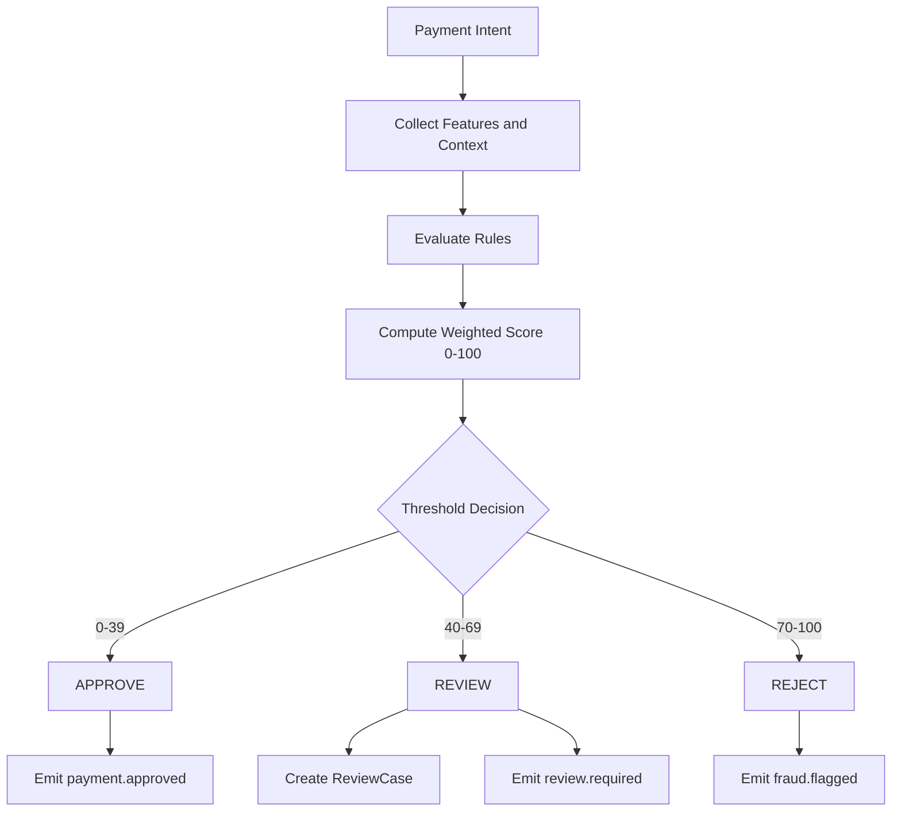

# Fraud Scoring Flow

Fraud scoring combines deterministic rules with weighted signals and produces:

- `risk_score` in `[0..100]`
- `decision`: `APPROVE`, `REVIEW`, or `REJECT`
- `reasons`: matched rules/signals for explainability

## Decision Thresholds

- `0-39`: `APPROVE`
- `40-69`: `REVIEW`
- `70-100`: `REJECT`

## Rules and Signals

- Velocity: more than `N` payments per account per minute
- Novelty: new device + high amount
- Geo mismatch: IP country differs from profile country
- Repeated declines in short window
- Amount anomaly vs historical baseline
- New account + immediate high-value transfer

Each matched rule creates a `FraudSignal` with `weight`.

## Flow Diagram

## Manual Review

Review queue should capture:

- payment identifier
- score and reasons
- timeline of events
- reviewer decision (`approve` or `reject`)
- decision actor and timestamp

Late reviewer decisions must be validated against current payment state before applying.

## Explainability Requirements

- Include top reason codes and human-readable message.
- Persist raw signals for audit and model tuning.
- Expose `GET /payments/{id}/risk` for operator investigation.
