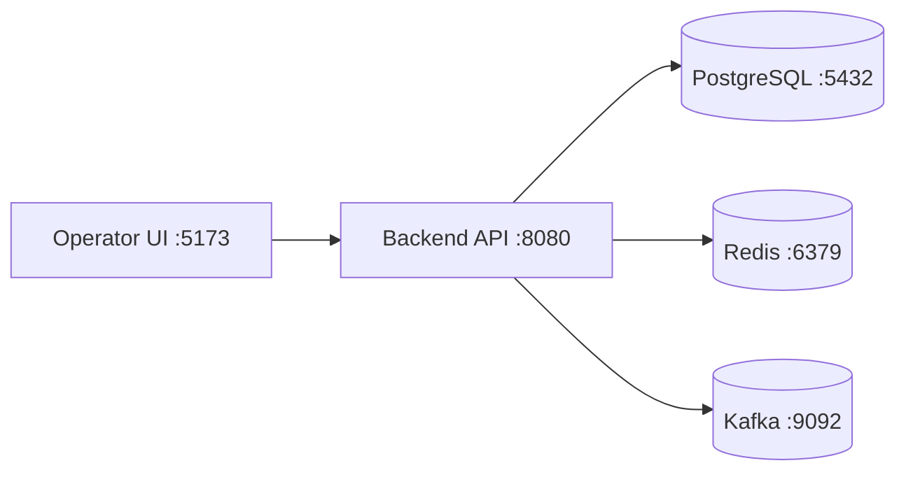

# Local Demo Runbook

This runbook provides a concrete path to run and present the current backend and operator console locally.

## Prerequisites

- Java 17+
- Maven 3.8+
- Node.js 18+
- Docker + Docker Compose (for PostgreSQL and optional Redis/Kafka)

## Local Topology

Only PostgreSQL is required by the backend today. Redis and Kafka are available behind the compose `extended` profile so the local topology can match the planned production shape without making the default path heavy.

## Startup Sequence

### Option A: zero-dependency backend

1. Start backend with the default in-memory H2 database:
   - `cd backend`
   - `mvn spring-boot:run`
2. Start frontend:
   - `export VITE_API_BEARER_TOKEN="$(./scripts/generate-operator-token.py --subject operator.admin@ledgerforge.local --role ADMIN)"`
   - `cd frontend`
   - `npm install`
   - `npm run dev`
3. Seed demo data and run the smoke flow:
   - `./scripts/demo-run.sh`
4. Open dashboard:
   - `http://127.0.0.1:5173`

### Option B: PostgreSQL-backed run

1. Start infrastructure:
   - `./scripts/dev-up.sh`
   - optional full topology: `./scripts/dev-up.sh --extended`
2. Start backend against PostgreSQL:
   - `cd backend`
   - `SPRING_PROFILES_ACTIVE=postgres mvn spring-boot:run`
3. Start frontend:
   - `export VITE_API_BEARER_TOKEN="$(./scripts/generate-operator-token.py --subject operator.admin@ledgerforge.local --role ADMIN)"`
   - `cd frontend`
   - `npm install`
   - `npm run dev`
4. Seed demo data:
   - `./scripts/demo-run.sh`
5. Stop infrastructure when finished:
   - `./scripts/dev-down.sh`
   - remove local volumes: `./scripts/dev-down.sh --volumes`

## Demo Script

1. Run `./scripts/seed-demo.sh` if you want only seeded data without the smoke assertions.
2. Keep one reviewer token handy if you want to approve the review case by `curl` instead of using the admin demo token:
   - `export REVIEWER_TOKEN="$(./scripts/generate-operator-token.py --subject risk.reviewer@ledgerforge.local --role REVIEWER)"`
3. Show the first seeded payment progressing through `CREATED -> RESERVED -> CAPTURED`.
4. Open `GET /api/payments/{id}/ledger` for the captured payment and point out reserve plus capture journals.
5. Show `GET /api/accounts/{id}/balance` for payer/payee accounts and explain that balances are projected from immutable entries.
6. Open the second seeded payment and show `GET /api/payments/{id}/risk`.
7. Open `GET /api/fraud/reviews` and inspect the pending manual-review case.
8. Approve or reject the review using `POST /api/fraud/reviews/{id}/decision`.
9. Refresh the payment state and show the review transition back into the ledger-backed lifecycle.
10. Open the operator UI at `http://127.0.0.1:5173` and use the seeded payment ids to cross-check the same states visually.
11. In the payment explorer, inspect execution timeline, ledger legs, retry history, and audit trail for the reviewed payment.
12. In the fraud/reconciliation console, inspect retry/recon counts and walk through the recommended repair playbook for any anomaly row.

If `/api/metrics` or `/api/reconciliation/reports` are not implemented yet, the operator UI now derives those views from live payment and ledger responses instead of dropping back to full mock data. Only a missing core payment API should trigger mock fallback.

For copy-paste `curl` requests covering create, confirm, capture, risk, and manual review, use [`local-api-requests.md`](local-api-requests.md).

## Verification Checklist

- `./scripts/smoke-test.sh` passes against the running backend.
- Journal entries balance to zero for each transaction.
- Duplicate `POST /payments` with same key is idempotent.
- Duplicate `confirm` and `capture` calls do not post duplicate journals.
- Audit timeline includes every mutation.
- Fraud decisions include reason codes.
- Dashboard reflects ledger and payment state consistently.

## Troubleshooting

- If backend fails on migrations with PostgreSQL: `./scripts/dev-down.sh --volumes` and restart the compose stack.
- If `./scripts/demo-run.sh` fails immediately: confirm the backend is answering `GET /actuator/health`.
- If the UI shows an auth error or drops into mock mode unexpectedly: verify `VITE_API_BASE_URL`, `VITE_API_BEARER_TOKEN`, and the backend JWT secret and issuer settings match.
- If manual-review approval returns a conflict: the case was already decided; seed a new review payment and retry.
