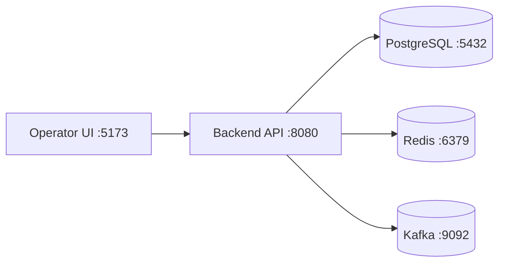

# Local Demo Runbook

This runbook provides a practical path to demo the platform locally with the secured operator API enabled.

## Prerequisites

- Java 17+
- Maven 3.8+
- Node.js 18+
- Docker + Docker Compose (for Postgres/Kafka/Redis optional stack)

## Suggested Local Topology

## Startup Sequence (Target)

1. Start dependencies:
   - `docker compose up -d postgres redis kafka`
2. Start backend:
   - `cd backend`
   - `mvn spring-boot:run`
3. Start frontend:
   - `export VITE_API_BEARER_TOKEN="$(./scripts/generate-operator-token.py --subject operator.admin@ledgerforge.local --role ADMIN)"`
   - `cd frontend`
   - `npm install`
   - `npm run dev`
4. Open dashboard:
   - `http://127.0.0.1:5173`

## Demo Script

1. Generate one admin token and one reviewer token:
   - `export ADMIN_TOKEN="$(./scripts/generate-operator-token.py --subject operator.admin@ledgerforge.local --role ADMIN)"`
   - `export REVIEWER_TOKEN="$(./scripts/generate-operator-token.py --subject risk.reviewer@ledgerforge.local --role REVIEWER)"`
2. Run `./scripts/seed-demo.sh` to create demo accounts and one captured payment.
3. Create a second high-risk payment and confirm it into manual review.
4. Inspect `GET /api/fraud/reviews` with a viewer or admin token.
5. Approve or reject the review using `POST /api/fraud/reviews/{id}/decision` with the reviewer token.
6. Inspect payment state, ledger entries, and account balances after the review decision.

## Verification Checklist

- Journal entries balance to zero for each transaction.
- Duplicate `POST /payments` with same key is idempotent.
- Duplicate `capture` does not double-charge.
- Audit timeline includes every mutation.
- Unauthorized requests return JSON `401` and `403` responses and append security audit events.
- Fraud decisions include reason codes.
- Dashboard reflects ledger and payment state consistently.

## Troubleshooting

- If backend fails on migrations: reset local DB volume and rerun.
- If stale balances appear: replay projection endpoint and refresh UI.
- If events are delayed: inspect outbox backlog and broker health.
- If fraud service timeout spikes: force fallback to `REVIEW` and inspect latency metrics.
- If the UI or scripts receive `401` or `403`: verify the bearer token issuer, audience, and shared HMAC secret match the backend config.
