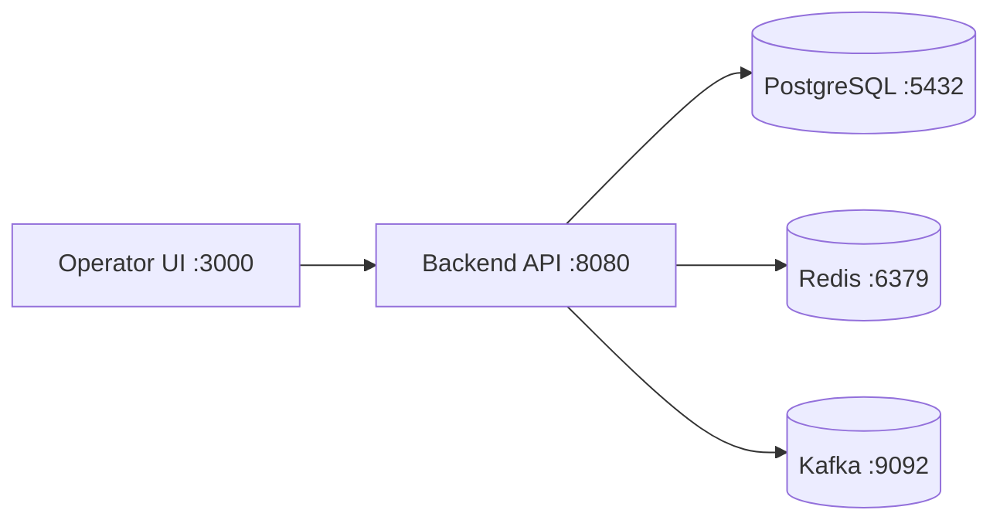

# Local Demo Runbook

This runbook provides a practical path to demo the platform once backend/frontend code is available.

## Prerequisites

- Java 17+
- Maven 3.8+
- Node.js 18+
- Docker + Docker Compose (for Postgres/Kafka/Redis optional stack)

## Suggested Local Topology

## Startup Sequence (Target)

1. Start dependencies:
   - `docker compose up -d postgres redis kafka`
2. Start backend:
   - `cd backend`
   - `mvn spring-boot:run`
3. Start frontend:
   - `cd frontend`
   - `npm install`
   - `npm run dev`
4. Open dashboard:
   - `http://localhost:3000`

## Demo Script

1. Create two accounts (`payer`, `payee`) in same currency.
2. Fund payer via seed/admin endpoint.
3. Create payment intent with idempotency key.
4. Confirm payment and show fraud score + decision.
5. Capture payment and inspect ledger entries.
6. Query account balances and show projection correctness.
7. Trigger high-risk payment and show manual review queue.
8. Approve/reject review case and verify state transitions.
9. Run reconciliation endpoint and show no mismatches.

## Verification Checklist

- Journal entries balance to zero for each transaction.
- Duplicate `POST /payments` with same key is idempotent.
- Duplicate `capture` does not double-charge.
- Audit timeline includes every mutation.
- Fraud decisions include reason codes.
- Dashboard reflects ledger and payment state consistently.

## Troubleshooting

- If backend fails on migrations: reset local DB volume and rerun.
- If stale balances appear: replay projection endpoint and refresh UI.
- If events are delayed: inspect outbox backlog and broker health.
- If fraud service timeout spikes: force fallback to `REVIEW` and inspect latency metrics.
