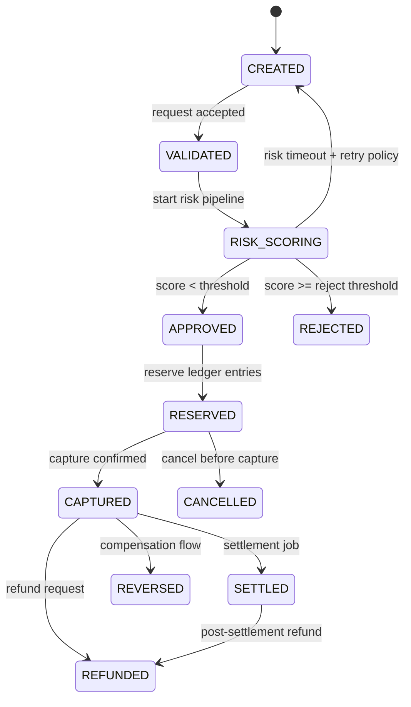

# Payment State Machine

This state machine defines legal payment transitions and guards.

## States

- `CREATED`: intent exists but not yet validated
- `VALIDATED`: request schema/business checks passed
- `RISK_SCORING`: fraud checks in progress
- `APPROVED`: risk accepted
- `RESERVED`: funds hold recorded in ledger
- `CAPTURED`: payment captured in ledger
- `SETTLED`: final settlement complete
- `REJECTED`: denied by risk/rules
- `REVERSED`: compensated after partial success
- `REFUNDED`: captured payment refunded
- `CANCELLED`: intent canceled before capture

## Transition Diagram

## Transition Rules

1. `CREATE` is idempotent by `(merchant_id, idempotency_key)`.
2. `CAPTURE` is allowed once. Repeated capture is no-op or conflict.
3. `REFUND` requires prior `CAPTURED` or `SETTLED` state.
4. `CANCEL` allowed only before `CAPTURED`.
5. Any failed side-effect after ledger commit requires compensating transition (`REVERSED`) and audit event.

## API-to-State Mapping

- `POST /payments`: creates `CREATED`
- `POST /payments/{id}/confirm`: runs validation + risk, reaches `APPROVED` or `REJECTED`
- `POST /payments/{id}/capture`: transitions `RESERVED -> CAPTURED`
- `POST /payments/{id}/refund`: transitions to `REFUNDED`
- `POST /payments/{id}/cancel`: transitions to `CANCELLED`

## Idempotency Behavior

- Same idempotency key with same payload returns original response.
- Same key with different payload returns conflict.
- All mutation endpoints should persist idempotency record and response hash.
