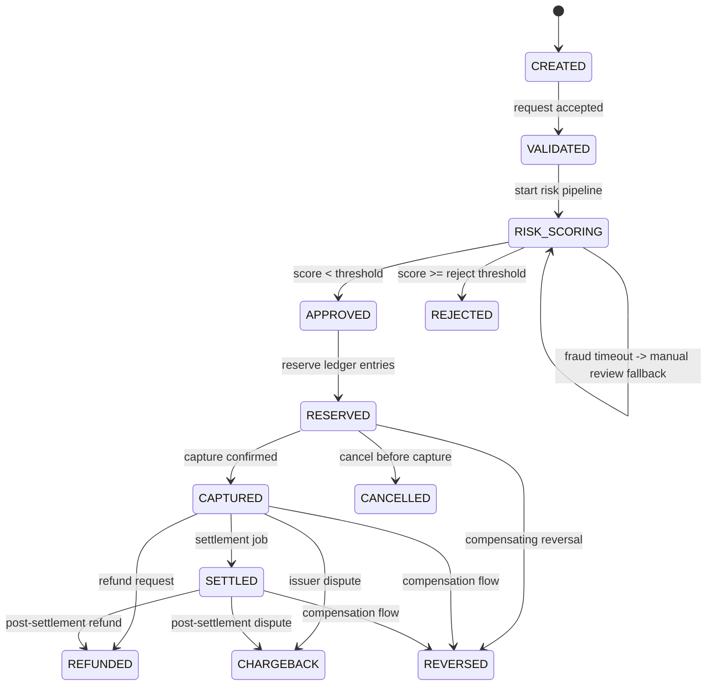

# Payment State Machine

This state machine defines legal payment transitions and guards.

## States

- `CREATED`: intent exists but not yet validated
- `VALIDATED`: request schema/business checks passed
- `RISK_SCORING`: fraud checks in progress
- `APPROVED`: risk accepted
- `RESERVED`: funds hold recorded in ledger
- `CAPTURED`: payment captured in ledger
- `SETTLED`: final settlement complete
- `REJECTED`: denied by risk/rules
- `REVERSED`: compensated after partial success
- `CHARGEBACK`: disputed after capture/settlement and clawed back through the ledger
- `REFUNDED`: captured payment refunded
- `CANCELLED`: intent canceled before capture

## Transition Diagram

## Transition Rules

1. `CREATE` is idempotent by `(merchant_id, idempotency_key)`.
2. `CAPTURE` is allowed once. Repeated capture is no-op or conflict.
3. `REFUND` requires prior `CAPTURED` or `SETTLED` state.
4. `CANCEL` is allowed from `CREATED`, `RISK_SCORING`, or `RESERVED`, but not after capture.
5. `REVERSE` is allowed from `RESERVED`, `CAPTURED`, or `SETTLED` and must append an immutable reversal journal plus adjustment record.
6. `CHARGEBACK` is allowed only from `CAPTURED` or `SETTLED` and must append a dispute-specific journal plus adjustment record.
7. `CAPTURED` payments receive a `settlementScheduledFor` timestamp at the next `17:00 UTC` cutoff and stay in `CAPTURED` until a settlement run includes them in a batch.
8. `FROZEN` payer/payee accounts block `CREATE`, `CONFIRM`, `CAPTURE`, and manual-review approval, but operator recovery actions (`REVERSE`, `REFUND`, `CHARGEBACK`) remain allowed.
9. Any failed side-effect after ledger commit requires compensating transition (`REVERSED`) and audit event.

## API-to-State Mapping

- `POST /payments`: creates `CREATED`
- `POST /payments/{id}/confirm`: runs validation + risk, then either reaches `RESERVED`, reaches `REJECTED`, or stays `RISK_SCORING` while manual review is pending
- `POST /payments/{id}/capture`: transitions `RESERVED -> CAPTURED`
- `POST /payments/{id}/refund`: transitions to `REFUNDED`
- `POST /payments/{id}/reverse`: transitions `RESERVED|CAPTURED|SETTLED -> REVERSED`
- `POST /payments/{id}/chargeback`: transitions `CAPTURED|SETTLED -> CHARGEBACK`
- `POST /payments/{id}/cancel`: transitions to `CANCELLED`
- `GET /payments/{id}/adjustments`: returns immutable refund/reversal/chargeback history with journal references
- `POST /api/settlements/run`: transitions due `CAPTURED` payments into `SETTLED`, creates one settlement batch per cutoff/currency, and schedules one payout per payee within that batch
- `GET /api/settlements/batches`: lists completed settlement batches
- `POST /api/payouts/run`: executes due payouts by posting a `PAYOUT` journal from the payee account into `SYSTEM_PAYOUT_CLEARING`, or marks the payout `DELAYED` if the merchant balance is no longer sufficient
- `GET /api/payouts`: lists scheduled, delayed, and paid payouts

## Payout Lifecycle

- `SCHEDULED`: payout exists and is waiting for `scheduledFor`
- `DELAYED`: payout reached its run window but merchant balance no longer covered the settled amount, usually after a refund or chargeback
- `PAID`: payout journal posted successfully and funds moved from the merchant account into the clearing account

## Idempotency Behavior

- Same idempotency key with same payload returns original response.
- Same key with different payload returns conflict.
- Concurrent create attempts with the same idempotency key must converge on the committed payment intent and must not duplicate audit or outbox records.
- A fraud-scoring timeout keeps the payment in `RISK_SCORING`, persists a `FRAUD_TIMEOUT` signal, and opens the manual-review path instead of mutating ledger balances.
- All mutation endpoints should persist idempotency record and response hash.
